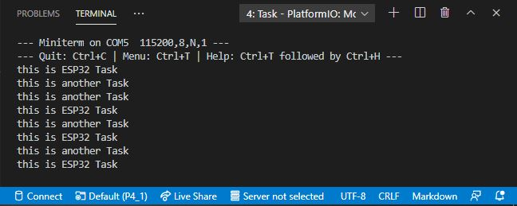

# PRACTICA 4_1  : Sistemas Operativos En Tiempo Real

## 1.Salida Del Terminal y Pregunta Inicial

¿Qué sucede si está utilizando una
pantalla de tinta electrónica que tarda unos segundos en actualizarse?

Respuesta:

Si efectuamos unas tareas sincronas, una detrás de la otra, y, por ejemplo, la de en medio tarda en actualizarse, el procesador se quedará pensando hasta que finalmente se resuelva el problema. De manera que, estará ocupado con esta tarea cuando podría ocuparse de la que viene posteriormente, mientras que la de en medio se está procesando.

## 2.Funcionamiento

Primero de todo, definimos la cabezera de la función que crea
la tarea ("anotherTask").

Posteriormente, definimos el void setup. En él, ejecutamos la instrucción "xTaskCreate" para importar a la configuración de el programa las propiedades de nuestra tarea.

Después, en el void loop, definimos una instrucción para que imprima por el terminal la línea "this is ESP32 Task" para conocer cuando se ha ejecutado la tarea.

Finalmente, el código acaba con la definición de la tarea "anotherTask", la cual imprime la línea "this is another Task" por el terminal infinitamente, hasta que el usuario interrumpa el proceso.